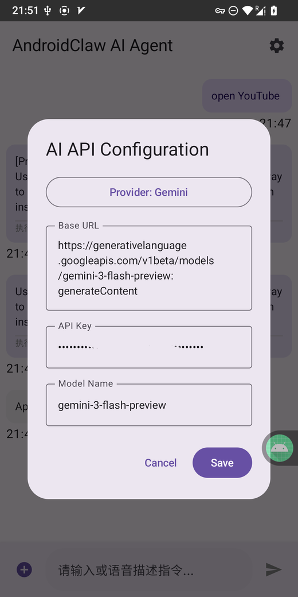

# AndroidClaw AI Agent

**AndroidClaw** is an intelligent Android automation assistant powered by Large Language Models (LLMs) such as Google Gemini, OpenAI GPT, and local Ollama instances. Unlike traditional automation tools, AndroidClaw "understands" your natural language commands, "perceives" your screen content, and "acts" by making logical decisions to complete tasks.

## 🚀 Key Features

- **Multimodal AI Integration**: Supports Gemini , OpenAI API, and local LLMs via Ollama ，I only tested Gemini. 
- **Screen Perception**: Leverages Android Accessibility Services to "read" the UI hierarchy and understand the current context.
- **Three-Tier Action Execution**:
    - **Intent**: Fast, direct system calls for alarms, URLs, and settings.
    - **Click**: Precise UI interaction by simulating taps on specific coordinates.
    - **Shell (Root)**: High-level system control via SU commands for advanced automation.
- **Recursive Reasoning (Agentic Loop)**: Remembers previous steps to complete complex, multi-stage tasks (e.g., "Go to WeChat and clear my cache").
- **Safety First**:
    - **Global Emergency Stop**: A red floating button that stays on top of all apps to instantly kill the AI process.
    - **Human-in-the-Loop**: Confirmation dialogs for all sensitive Click and Shell operations.
- **Voice-Enabled**: Integrated Speech-to-Text (STT) for hands-free commanding.
- **Modern UI**: Built entirely with Jetpack Compose for a smooth, responsive chat-like experience.

<video width="300" controls>
  <source src="./assets/show.mp4" type="video/mp4">
  您的浏览器不支持视频播放。
</video>

## 🛠 How It Works

1. **User Command**: You provide a task via text or voice (e.g., "Set an alarm for 8 AM" or "Open YouTube").
2. **Screen Analysis**: The app captures the current UI Tree (Accessibility Data).
3. **AI Reasoning**: The prompt (containing your goal + screen data + history) is sent to the LLM.
4. **Action Selection**:
    - If it's a simple task, the AI returns an **Intent**.
    - If it's complex, the AI returns a **Click** or **Shell** command.
5. **Closed-Loop Execution**: After a click, the app waits for the screen to refresh, re-scans the UI, and asks the AI for the next step until the task is marked as "finished."

## 📋 Prerequisites

- **Android Version**: Android 8.0 (API 26) or higher.
- **Accessibility Service**: Must be manually enabled in `Settings > Accessibility` for screen perception.
- **Overlay Permission**: Required for the Emergency Stop button.
- **Root Access (Optional)**: Only required if you intend to use `sh` (Shell) commands.
- **API Key**: A valid key from Google AI Studio (Gemini) or OpenAI.

## ⚙️ Configuration

Open the **Settings** dialog in the app to configure your AI provider:

| Field | Description                                                                                             |
| :--- |:--------------------------------------------------------------------------------------------------------|
| **Provider** | Choose between `Gemini`, `OpenAI`, or `Ollama`.                                                         |
| **Base URL** | The API endpoint (e.g., `https://generativelanguage.googleapis.com/v1beta`).                            |
| **API Key** | Your private secret key.                                                                                |
| **Model** | The model name (e.g., `gemini-3-flash-preview` or `gpt-4o`). For gemini, you only need to enter the URL |

> **Note for Ollama users**: Use `http://10.0.2.2:11434/v1` as the Base URL if running on an Android Emulator.

## ⚠️ Safety & Privacy

- **Privacy**: This app sends your screen's UI text data to the selected AI provider. Avoid using the Agent on screens containing sensitive information (passwords, banking).
- **Control**: The AI cannot perform a Click or Shell action without your explicit permission via the on-screen confirmation dialog.
- **Emergency Stop**: If the AI begins performing unexpected actions, tap the **STOP** floating button immediately to freeze all processes.

## 🏗 Installation

1. Clone the repository.
2. Open the project in **Android Studio (Ladybug or newer)**.
3. Build and install the APK on your device.
4. Grant **Accessibility** and **Display over other apps** permissions.

---

### Disclaimer
*This project is for educational and research purposes only. The authors are not responsible for any data loss or device damage caused by the AI's autonomous actions.*